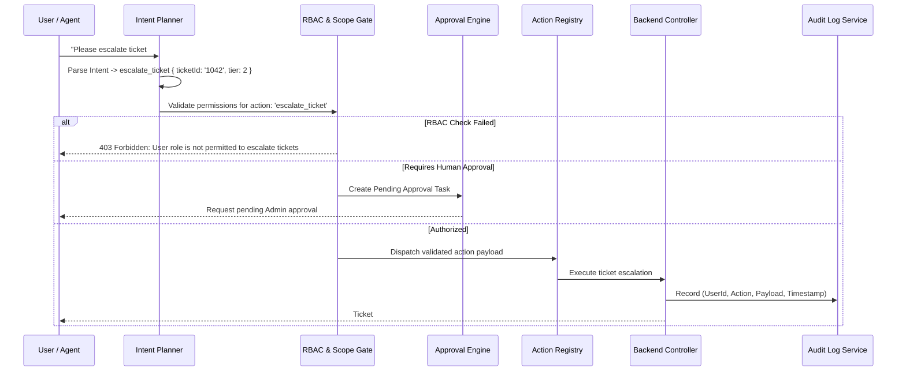

# Autonomous AI Agent Architecture & Governance

SupportAI features an autonomous **AI Copilot & Support Agent Engine** that executes backend tasks safely under strict Role-Based Access Control (RBAC), tenant boundaries, and human-in-the-loop approvals.

---

## 1. Agent Execution Lifecycle



---

## 2. Intent Planner & Tool Registry

### 2.1 Intent Planner (`intentPlanner.js`)
- Receives user conversation context and available schema-defined tools.
- Emits structured, type-safe JSON function calls matching Zod schemas.
- Handles fallback re-prompting when parameter validation fails.

### 2.2 Action Registry (`actionRegistry.js`)
Every callable tool is explicitly registered with its input schema, required permissions, and risk level:

```javascript
export const ActionRegistry = {
  create_ticket: {
    description: 'Create a new customer support ticket',
    requiredRole: ['customer', 'support', 'branch_admin', 'admin', 'super_admin'],
    requiresApproval: false,
    handler: async (ctx, params) => { /* ... */ }
  },
  escalate_ticket: {
    description: 'Escalate ticket to higher tier',
    requiredRole: ['support', 'branch_admin', 'admin', 'super_admin'],
    requiresApproval: false,
    handler: async (ctx, params) => { /* ... */ }
  },
  delete_document: {
    description: 'Delete document from organization knowledge base',
    requiredRole: ['admin', 'super_admin'],
    requiresApproval: true, // Triggers approval workflow
    handler: async (ctx, params) => { /* ... */ }
  }
};
```

---

## 3. Strict Permission Matrix

| Action | Customer | Support Agent | Branch Admin | Org Admin | SuperAdmin | Requires Approval |
| :--- | :---: | :---: | :---: | :---: | :---: | :---: |
| **Search Knowledge Base** | ✅ Public Chunks | ✅ All Chunks | ✅ All Chunks | ✅ All Chunks | ✅ All Chunks | No |
| **Create Ticket** | ✅ | ✅ | ✅ | ✅ | ✅ | No |
| **Update Ticket** | Own Only | Assigned Only | Branch Scope | Org Scope | Global Scope | No |
| **Close Ticket** | ❌ | ✅ | ✅ | ✅ | ✅ | No |
| **Escalate Ticket** | ❌ | ✅ | ✅ | ✅ | ✅ | No |
| **Upload Document** | ❌ | ❌ | ✅ | ✅ | ✅ | No |
| **Approve Document** | ❌ | ❌ | ❌ | ✅ | ✅ | No |
| **Delete Document** | ❌ | ❌ | Branch Scope (Pending) | ✅ | ✅ | Yes (for Branch) |
| **Modify AI Config** | ❌ | ❌ | ❌ | ✅ | ✅ | Yes |

---

## 4. Multi-Tenant Scoping Chain

The AI agent execution engine enforces a 6-step non-bypassable verification chain before executing any mutation:

$$\text{User Request} \longrightarrow \text{JWT Verify} \longrightarrow \text{Tenant Scope} \longrightarrow \text{Branch Scope} \longrightarrow \text{RBAC Gate} \longrightarrow \text{Resource Ownership} \longrightarrow \text{Audit Log}$$

---

## 5. Model Health & Fallback Engine (`modelHealth.service.js`)

SupportAI monitors LLM latency, error rates, and quota exhaustion in real-time:
- **Primary Model:** Google Gemini 1.5/2.0 Pro / Flash.
- **Failover 1:** xAI Grok 2.
- **Failover 2:** Anthropic Claude 3.5 Sonnet.
- **Failover 3 (Offline / Local):** Ollama (`nomic-embed-text` / `llama3`).
- **Circuit Breaker:** Automatically trips on 3 consecutive 5xx errors and redirects traffic to the next healthy provider.
