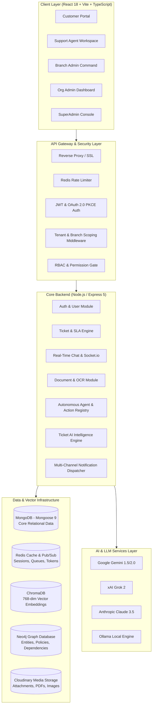

# SupportAI — System Architecture & Technical Specifications

SupportAI is an enterprise-grade AI customer support platform built on a multi-tenant, branch-scoped architecture. It merges traditional customer service workflows (tickets, live chat, SLAs) with modern autonomous AI systems (Hybrid RAG, Graph RAG, Intent-driven Copilots, and Automated Ticket Intelligence).

---

## 1. High-Level System Architecture



---

## 2. Multi-Tenant & Hierarchical Scoping Model

SupportAI implements a 5-tier Role-Based Access Control (RBAC) model combined with tenant and branch data isolation:

```
┌────────────────────────────────────────────────────────┐
│ LEVEL 0: SuperAdmin (Platform Owner)                   │
│ • Full platform governance & global tenant management  │
└───────────────────────────┬────────────────────────────┘
                            │ Manages
                            ▼
┌────────────────────────────────────────────────────────┐
│ LEVEL 1: Organization Admin (Tenant Admin)             │
│ • Manages single company, billing, AI config, KB docs  │
└───────────────────────────┬────────────────────────────┘
                            │ Manages
                            ▼
┌────────────────────────────────────────────────────────┐
│ LEVEL 2: Branch Admin (Sub-Tenant / Regional Lead)     │
│ • Manages localized branch office, staff, local queues │
└───────────────────────────┬────────────────────────────┘
                            │ Manages
                            ▼
┌────────────────────────────────────────────────────────┐
│ LEVEL 3: Support Agent                                 │
│ • Resolves assigned tickets, uses AI Copilot & tools   │
└────────────────────────────────────────────────────────┘
                            ▲ Serves
                            │
┌────────────────────────────────────────────────────────┐
│ LEVEL 4: Customer (End User)                           │
│ • AI Chat assistant, creates tickets, browses public KB│
└────────────────────────────────────────────────────────┘
```

### Data Isolation Guarantees
Every database query in the platform enforces mandatory tenancy filters:
```javascript
// Strict Query Scoping Filter
const baseQuery = {
  organization_id: req.user.organization_id,
  ...(req.user.role === 'branch_admin' || req.user.role === 'support' 
      ? { branch_id: req.user.branch_id } 
      : {})
};
```

---

## 3. Core Subsystems

### 3.1 Real-Time WebSocket Messaging (`Socket.io`)
- **Event Channels:**
  - `ticket:join` / `ticket:leave`: Dynamically scopes socket listeners to individual ticket threads.
  - `ticket:message`: Streams customer and agent messages instantly.
  - `ticket:typing`: Shows live typing status indicator.
  - `ticket:ai_stream`: Streams LLM tokens in real-time as the RAG response is constructed.
  - `notification:broadcast`: Pushes instant in-app alerts to targeted users or role rooms.

### 3.2 Hybrid RAG Pipeline
Combines dense semantic vector search with sparse keyword search and knowledge graph traversal:
1. **Document Upload & Parsing:** Supports PDF, DOCX, TXT, and images (OCR).
2. **Semantic Chunking:** Contextual chunks (512 tokens with 50-token window overlap) enriched with role access metadata.
3. **Multi-Index Querying:** ChromaDB (nomic-embed-text) + BM25 keyword matching + Neo4j entity graph.
4. **Cross-Encoder Reranking:** Merges candidate chunks and scores relevance using Reciprocal Rank Fusion (RRF).
5. **Grounded Synthesis:** Enforces strict provenance and interactive clickable citations.

### 3.3 Autonomous AI Agent Engine
- **Intent Planner:** Classifies natural language prompts into executable actions.
- **Action Registry:** Typed registry of callable backend business functions (`create_ticket`, `check_status`, `escalate`, `search_kb`, `update_user_settings`).
- **RBAC & Authorization Gate:** Guarantees that AI agents can never execute actions beyond the permissions of the calling user.
- **Human-In-The-Loop:** Critical actions (e.g. document deletion, billing changes) pause execution and trigger approval requests.

---

## 4. Database Topologies & Indexing

### MongoDB Compound Indexes
To guarantee sub-10ms query execution across millions of records:
- **`tickets`:** `{ organization_id: 1, branch_id: 1, status: 1, priority: 1, created_at: -1 }`
- **`tickets` (assignee queue):** `{ assignee_id: 1, status: 1, updated_at: -1 }`
- **`documents`:** `{ organization_id: 1, status: 1, allowed_roles: 1 }`
- **`chat_messages`:** `{ conversation_id: 1, created_at: 1 }`
- **`audit_logs`:** `{ organization_id: 1, created_at: -1, action: 1 }`

---

## 5. Security & Governance Architecture

1. **Authentication:** Dual-mode auth with JWT Bearer tokens, HTTP-only secure refresh tokens, and OAuth 2.0 with PKCE and CSRF state validation.
2. **API Key Management:** Cryptographically hashed SHA-256 organization keys with granular permission scopes and Redis token-bucket rate limiting.
3. **Audit Logging:** Non-repudiable audit logs recording all state mutations, agent tool calls, approval decisions, and user escalations.
