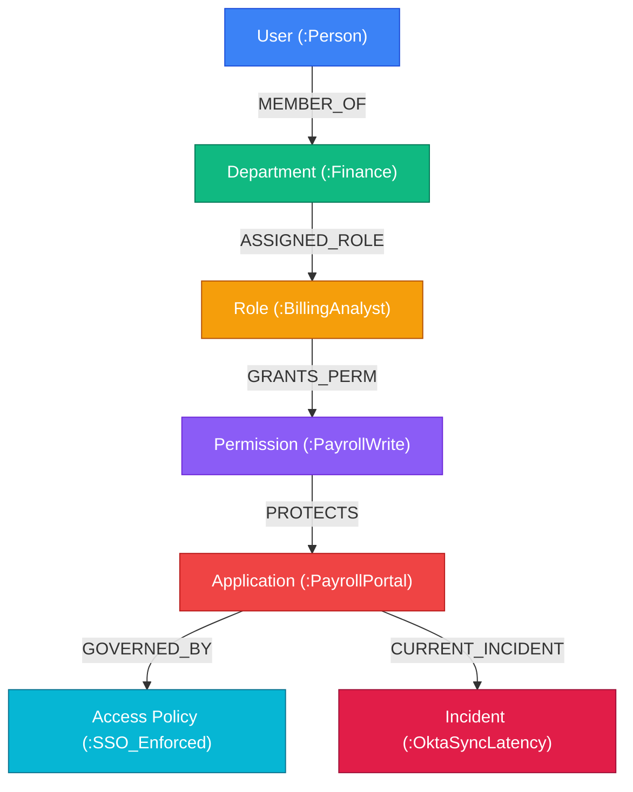

# Graph RAG & Knowledge Graph Architecture

SupportAI integrates a **Graph RAG engine powered by Neo4j**, transforming the knowledge base into a structured entity and relationship network that enables multi-hop reasoning beyond vector similarity alone.

---

## 1. Why Graph RAG?

Standard vector search excels at semantic matching (*"How do I reset my password?"*), but fails on relational and dependency reasoning (*"Why can't User X in Department Y access Application Z under current Access Policies?"*).

Graph RAG bridges this gap by mapping real-world business entities, access policies, permissions, and infrastructure dependencies.



---

## 2. Graph Schema & Node Types

### Node Labels
- `(:Organization)`: Multi-tenant boundary.
- `(:Branch)`: Localized office entity.
- `(:Topic)`: Knowledge domain category (e.g. *Authentication, Invoicing, Hardware*).
- `(:Document)`: Source document metadata.
- `(:Chunk)`: Text passage with embeddings.
- `(:Entity)`: Extracted real-world concept (Application, Role, Permission, Server, Protocol).
- `(:Incident)`: Active service interruption or outage.

### Relationship Types
- `[:BELONGS_TO_ORG]`: Tenant scoping.
- `[:MENTIONS]`: Chunk $\to$ Entity link.
- `[:DEPENDS_ON]`: Service dependency.
- `[:REQUIRES_ROLE]`: Role-based requirement.
- `[:GOVERNS]`: Policy $\to$ Resource constraint.
- `[:IMPACTS]`: Incident $\to$ Service link.

---

## 3. Entity & Relationship Extraction Pipeline

When an approved document is ingested into the knowledge base:
1. **Named Entity Recognition (NER):** Identifies domain entities (technologies, roles, access levels, products).
2. **Relation Extraction (RE):** Detects predicate triples (`(Subject, Predicate, Object)`).
3. **Graph Upsert:** Executes parameterized Cypher statements ensuring tenant isolation:
   ```cypher
   MERGE (org:Organization { id: $organizationId })
   MERGE (e1:Entity { name: $sourceName, orgId: $organizationId })
   MERGE (e2:Entity { name: $targetName, orgId: $organizationId })
   MERGE (e1)-[r:DEPENDS_ON { sourceDoc: $docId }]->(e2)
   ```

---

## 4. Multi-Hop Traversal Query Example

When an inquiry regarding access or service failure occurs:

```cypher
MATCH (u:User { email: $userEmail })-[:MEMBER_OF]->(d:Department)
MATCH (d)-[:ASSIGNED_ROLE]->(r:Role)-[:GRANTS_PERM]->(p:Permission)
MATCH (p)-[:PROTECTS]->(app:Application { name: $appName })
OPTIONAL MATCH (app)-[:CURRENT_INCIDENT]->(inc:Incident { status: 'active' })
RETURN u.name, r.name, p.name, app.name, inc.title, inc.severity
```

---

## 5. Combining Graph RAG with Vector Search

```
                 User Support Inquiry
                          │
         ┌────────────────┴────────────────┐
         ▼                                 ▼
   Vector Search                     Graph Traversal
   (ChromaDB)                           (Neo4j)
         │                                 │
         ▼                                 ▼
   Text Passages                     Entity Triples &
   & KB Articles                     Dependency Chains
         │                                 │
         └────────────────┬────────────────┘
                          ▼
             Combined Context Synthesis
                          │
                          ▼
            Context-Rich LLM Response
```
