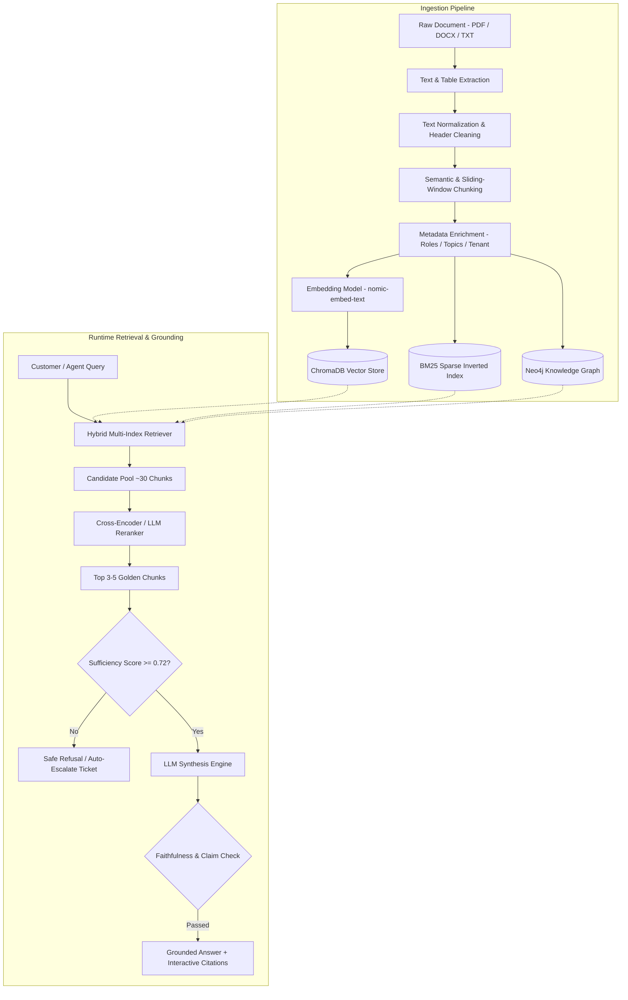

# Hybrid RAG & Grounded Retrieval Architecture

SupportAI implements an advanced **Multi-Stage Hybrid Retrieval-Augmented Generation (RAG)** pipeline designed for zero-hallucination enterprise customer support.

---

## 1. End-to-End RAG Ingestion & Query Pipeline



---

## 2. Ingestion Stages

### 2.1 Extraction & Normalization
- Extracts clean markdown, preserving section headers (`#`, `##`, `###`), bullet points, and tables.
- Strips non-informative boilerplate, duplicate whitespace, and unprintable binary artifacts.

### 2.2 Semantic & Sliding Window Chunking
Rather than arbitrary token cuts, chunks are partitioned along semantic boundaries:
- **Chunk Size:** 512 tokens.
- **Overlap Window:** 64 tokens with 50% boundary preservation.
- **Parent-Child Links:** Each chunk retains a parent document pointer and section hierarchy metadata to enable contextual expansion.

### 2.3 Metadata Schema per Chunk
```json
{
  "chunk_id": "chk_984210",
  "document_id": "doc_4412",
  "organization_id": "org_enterprise_01",
  "branch_id": "branch_na_east",
  "allowed_roles": ["customer", "support", "admin"],
  "document_title": "Enterprise SSO & Okta Integration Guide",
  "topic": "Authentication",
  "section": "Configuring SAML 2.0 Identity Provider",
  "page_number": 4,
  "trust_score": 0.99
}
```

---

## 3. Hybrid Multi-Index Retrieval & Reranking

### 3.1 Reciprocal Rank Fusion (RRF)
Retrieval candidates from ChromaDB (dense semantic similarity), BM25 (sparse keyword exact match), and Neo4j (graph proximity) are merged using Reciprocal Rank Fusion:

$$RRF(d) = \sum_{m \in \{\text{vector}, \text{bm25}, \text{graph}\}} \frac{w_m}{k + r_m(d)}$$

Where:
- $r_m(d)$ is the rank of chunk $d$ in index $m$.
- $k$ is the smoothing constant (default: $60$).
- $w_m$ is the modality weight ($w_{\text{vector}} = 0.5$, $w_{\text{bm25}} = 0.3$, $w_{\text{graph}} = 0.2$).

### 3.2 Cross-Encoder Reranking
The top 30 candidates from RRF are evaluated through a Cross-Encoder reranking model that scores query-document pairs simultaneously, filtering the pool down to the **top 3 to 5 highest-relevance chunks**.

---

## 4. Grounding & Anti-Hallucination Guardrails

```
User Query
    ↓
Hybrid Retrieval + Reranking
    ↓
Context Sufficiency Check
    ├── Score < 0.72 ──> "I do not have enough verified information in our knowledge base. Would you like me to open a support ticket?"
    └── Score >= 0.72
            ↓
    Grounded Prompt Construction (System Directive: 'Answer ONLY using provided facts')
            ↓
    LLM Response Generation
            ↓
    Faithfulness Verification (NLI Entailment Check)
            ├── Unsupported Claim Detected ──> Strip / Re-query / Escalate
            └── All Claims Verified ──> Return Response with Source Citations
```

---

## 5. Interactive Source Citations

Every AI response attaches clickable source metadata linking directly to the document and page in the interactive Document Viewer:

```markdown
To enable multi-factor authentication for your account, navigate to **Settings → Security** and toggle **Enforce MFA** `[Source 1]`. All backup codes must be saved securely `[Source 2]`.

---
**Verified Sources:**
- 📄 `[Source 1]` **[Account Security & MFA Guide](file:///d:/projects/supportai/customer-aibased-support/client/frontend/src/components/ui/DocumentViewer.tsx)** (Page 2, Section 3.1)
- 📄 `[Source 2]` **[Identity Protection Standard](file:///d:/projects/supportai/customer-aibased-support/client/frontend/src/components/ui/DocumentViewer.tsx)** (Page 7)
```
