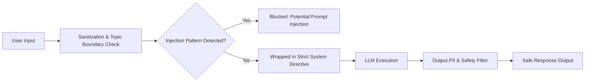

# Security, Multi-Tenant Isolation & Governance

SupportAI is designed from the ground up for strict enterprise isolation, role-based protection, non-repudiable audit logging, and resilient defense against prompt injection and unauthorized cross-tenant data access.

---

## 1. Multi-Tenant Data Isolation

SupportAI enforces strict tenant boundaries at both the database and application layers:

```
Incoming Request
       │
       ▼
[Authentication Middleware] ── Extract & verify JWT token
       │
       ▼
[Tenant Scoping Middleware] ── Inject req.user.organization_id & req.user.branch_id
       │
       ▼
[RBAC Permission Gate]     ── Assert role permissions (Level 0-4)
       │
       ▼
[Resource Ownership Check] ── Verify ticket/document belongs to organization_id
       │
       ▼
[Database Query Engine]    ── Force { organization_id: req.user.organization_id } in all queries
```

---

## 2. Authentication & Credential Architecture

### 2.1 Dual-Token Authentication (JWT)
- **Access Tokens:** Signed with RS256 / HS256, short-lived (15 minutes).
- **Refresh Tokens:** Stored in HTTP-only, Secure, SameSite=Strict cookies. Rotated on every refresh with single-flight deduplication.

### 2.2 OAuth 2.0 with PKCE & CSRF Protection
- Integrates Google and Facebook OAuth 2.0.
- Implements Proof Key for Code Exchange (PKCE) with code verifiers and cryptographically random `state` nonce parameters stored in Redis to prevent interception and replay attacks.

### 2.3 Organization API Keys
- API keys formatted as `sk_live_<org_prefix>_<random_entropy>`.
- Only the SHA-256 hash is stored in MongoDB.
- Scoped to explicit permissions: `['tickets:read', 'tickets:write', 'rag:query']`.

---

## 3. Rate Limiting & Abuse Prevention

SupportAI uses Redis-backed Token Bucket rate limiting:
- **Public Auth Endpoints (`/api/auth/*`):** 10 requests / minute per IP.
- **RAG & Chat Stream (`/api/chat/*`):** 60 requests / minute per user.
- **Organization API Keys:** Configurable quota per billing tier (e.g. 10,000 requests / day).

---

## 4. Prompt Injection & AI Guardrails



### Protection Measures:
1. **System Prompt Wrapping:** All user prompts are placed within immutable `<user_query>` tags.
2. **Topic Boundary Constraints:** RAG queries are restricted to authenticated company documentation.
3. **PII Masking:** Social security numbers, credit card tokens, and secrets are redacted prior to vector embedding and LLM prompt generation.

---

## 5. Audit Logging Service (`auditLog.service.js`)

Every sensitive administrative action, document mutation, and agent tool execution writes an immutable log:
```json
{
  "timestamp": "2026-08-24T10:45:00.000Z",
  "organization_id": "org_enterprise_01",
  "actor_id": "usr_948102",
  "actor_role": "admin",
  "action": "DOCUMENT_APPROVED",
  "resource_type": "Document",
  "resource_id": "doc_4412",
  "ip_address": "192.168.1.100",
  "user_agent": "Mozilla/5.0 ...",
  "status": "SUCCESS"
}
```
